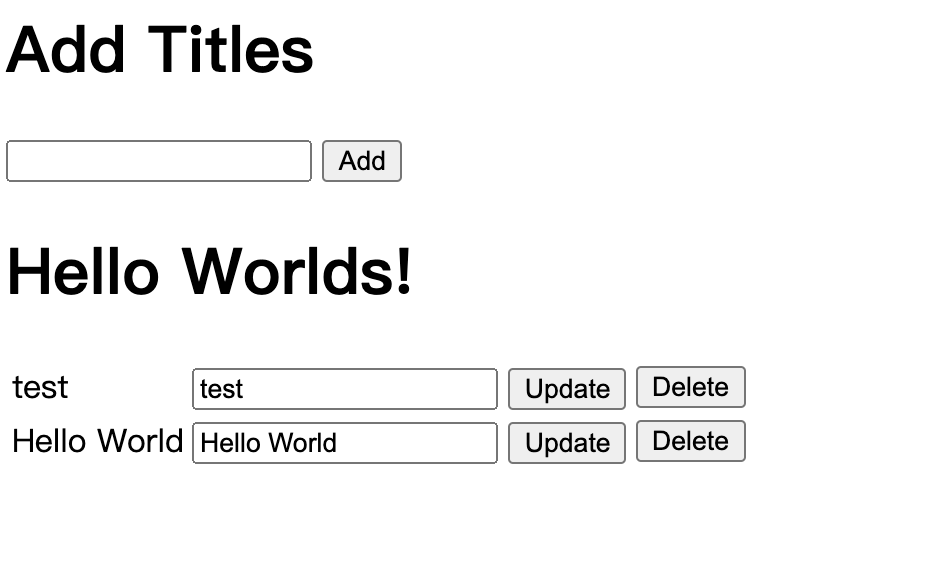

## flask-crud-example




### Running

```
docker run -p 34567:34567 mengpeilee/flask-crud:v1.0.0
```

or

```
$ virtualenv --python=/usr/bin/python3 venv
$ source ./venv/bin/activate
$ pip3 install -r requirements.txt
$ python3 app/server.py
```
